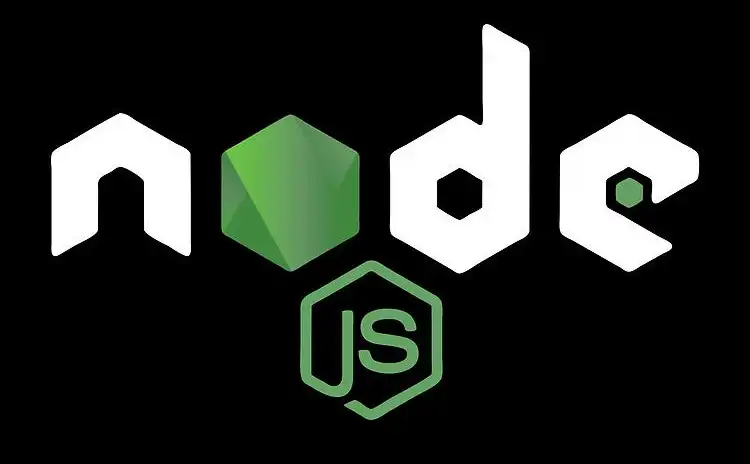
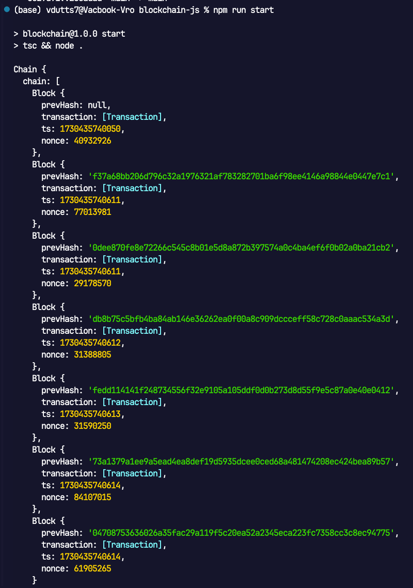

<div align="center">


  
  

  <h1 align="center">
        Node.js Blockchain
    </h1>
    <p align="center"> 
        <i><b>A simple blockchain and cryptocurrency wallet implemented in Node.js</b></i>
        <br /> 
    </p>

[![Github][github]][github-url]


</div>


## Table of Contents

  <ol>
    <a href="#FREE-200-USD-cloud-credits">💸 FREE 200 USD cloud credits</a><br/>
    <a href="#about">📝 About</a><br/>
    <a href="#how-to-build">💻 How to build</a><br/>
    <a href="#tools-used">🔧 Tools used</a>
        <ul>
        </ul>
    <a href="#contact">👤 Contact</a>
  </ol>

<br/>

## 💸FREE 200 USD cloud credits

Click the banner to activate $200 free personal cloud credits on DigitalOcean (deploy anything).

<div style="display: flex; align-items: center; justify-content: center; width: 400px;"> 
    <a href="https://www.digitalocean.com/?refcode=2aa0ec7cfd0e&utm_campaign=Referral_Invite&utm_medium=Referral_Program&utm_source=badge">
        
    </a>
</div>


## 📝About

- Basic blockchain implementation
- Proof of Work (PoW) consensus mechanism
- Cryptocurrency wallet functionality
- Transaction handling
- Block mining
- Chain validation


## API Endpoints

- `GET /blockchain` - Get the full blockchain
- `POST /transaction` - Create a new transaction
- `GET /mine` - Mine a new block
- `GET /balance/:address` - Get wallet balance


## 💻How to build


```
npm i
npm start
```

<div align="center">
    <i>Ex console output</i>
    
</div>

## 🔧Tools Used

[![TypeScript][typescript]][typescript-url]
[![Node.js][nodejs]][nodejs-url]
[![Crypto][crypto]][crypto-url]

## 👤Contact

<!-- Replace placeholders with your actual contact information -->
[![Email][email]][email-url]
[![Twitter][twitter]][twitter-url]

<!-- MARKDOWN LINKS & IMAGES -->
<!-- https://www.markdownguide.org/basic-syntax/#reference-style-links -->

[typescript]: https://img.shields.io/badge/TypeScript-007ACC?style=for-the-badge&logo=typescript&logoColor=white
[typescript-url]: https://www.typescriptlang.org/
[nodejs]: https://img.shields.io/badge/Node.js-43853D?style=for-the-badge&logo=node.js&logoColor=white
[nodejs-url]: https://nodejs.org/
[crypto]: https://img.shields.io/badge/Crypto-000000?style=for-the-badge&logo=node.js&logoColor=white
[crypto-url]: https://nodejs.org/api/crypto.html
[email]: https://img.shields.io/badge/me@vd7.io-FFCA28?style=for-the-badge&logo=Gmail&logoColor=00bbff&color=black
[email-url]: #
[github]: https://img.shields.io/badge/💻Github-000000?style=for-the-badge
[github-url]: https://github.com/vdutts7/blockchain-js
[twitter]: https://img.shields.io/badge/Twitter-FFCA28?style=for-the-badge&logo=Twitter&logoColor=00bbff&color=black
[twitter-url]: https://twitter.com/vdutts7/
